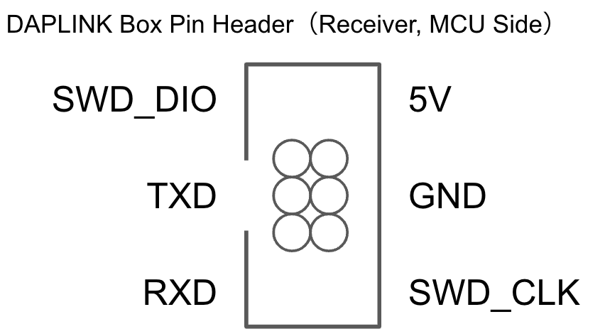
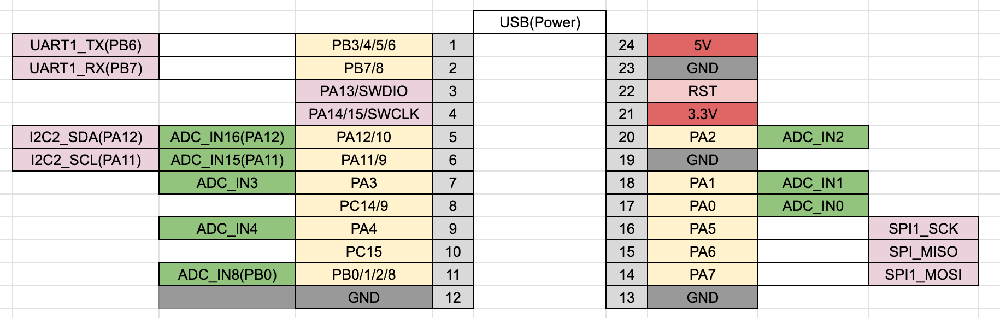

# STM32F03xfxp ProMicro

The box pin header for DAP Link has the following pin layout.

DAP Link 用のボックスピンヘッダは以下のピン配置になっています。

## v1.2.0

- [Semantics 回路図](stm32g03xfxp-semantcs-v1.2.0.pdf)
- [PCB](stm32g03xfxp-pcb.pdf)

### Pinout

For other functions, please refer to the datasheet.

他の機能はデータシートを参照ください。

### Parts

| id    | parts name                                  | num |
| ----- | ------------------------------------------- | --- |
| J1    | USB 2.0 Type-C Socket (Only Power)          | 1   |
| R1,R2 | 0806 Register 5.1k                          | 2   |
| R4    | 0806 Register 0                             | 1   |
| R3,R6 | 0806 Register 10k                           | 2   |
| C1    | 0806 Capacitor 10u                          | 1   |
| C2    | 0806 Capacitor 2.2u                         | 1   |
| C3,C4 | 0806 Capacitor 100n                         | 2   |
| U2    | TSSOP-20 MCU STM32G030F6Px                  | 1   |
| D1    | 0805 LED Blue                               | 1   |
| U1    | SOT-89 3.3V Regulator AMS1117-3.3           | 1   |
| SW1   | SKRPABE010 Push Switch                      | 1   |
| CH3   | Pitch 1.25mm 2x3 Box Pin Header DAPLink-SWD | 1   |
