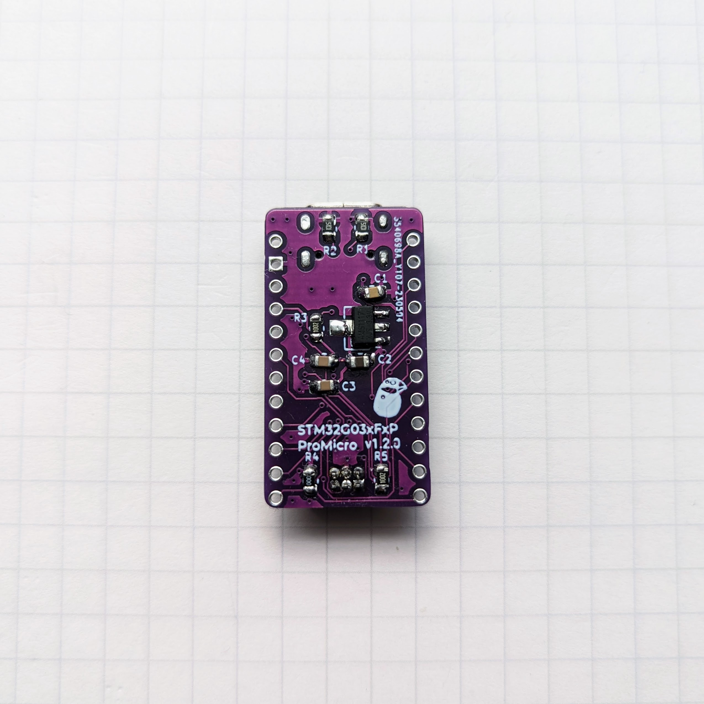
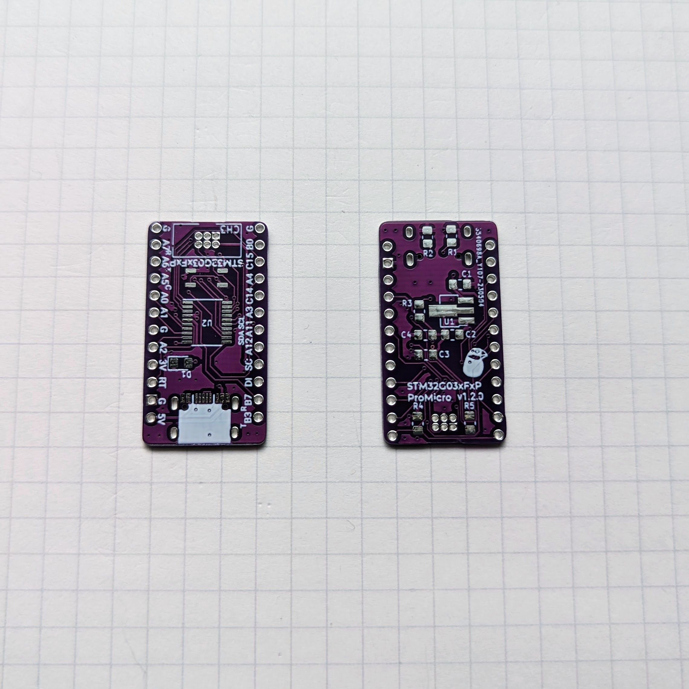
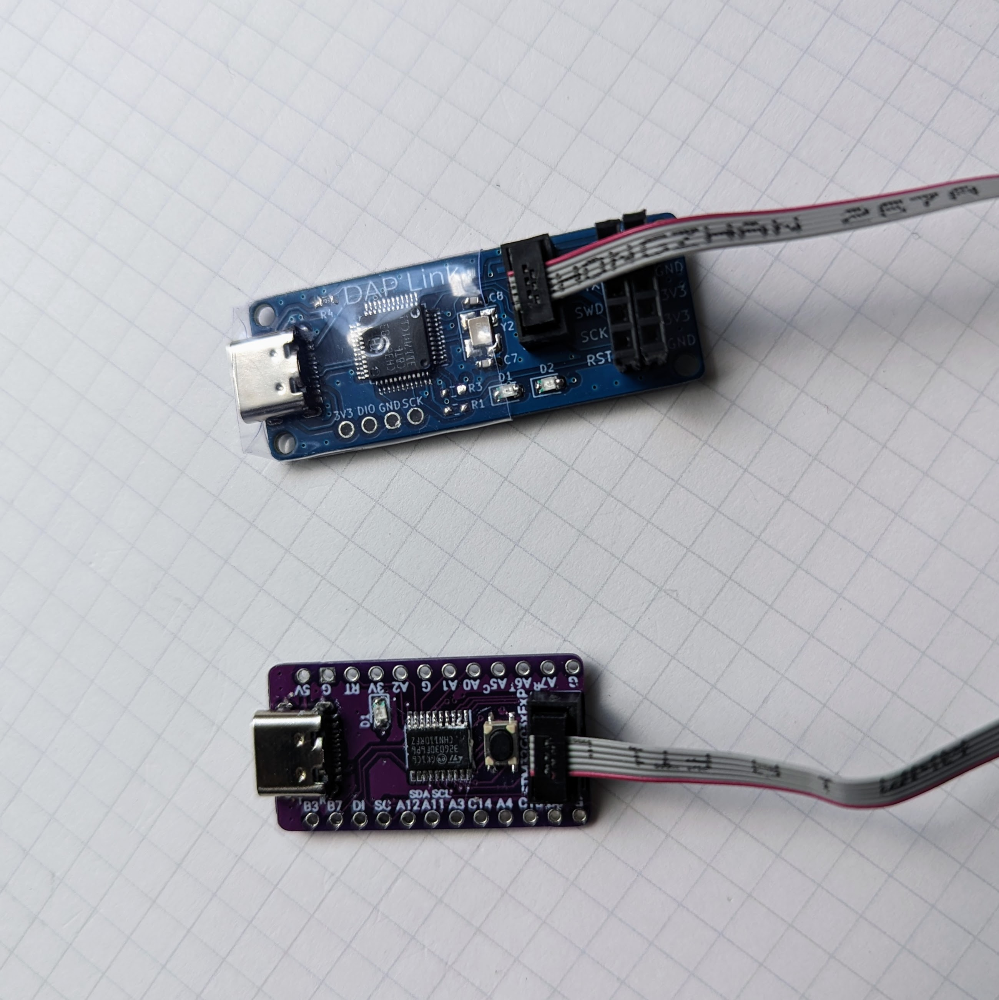
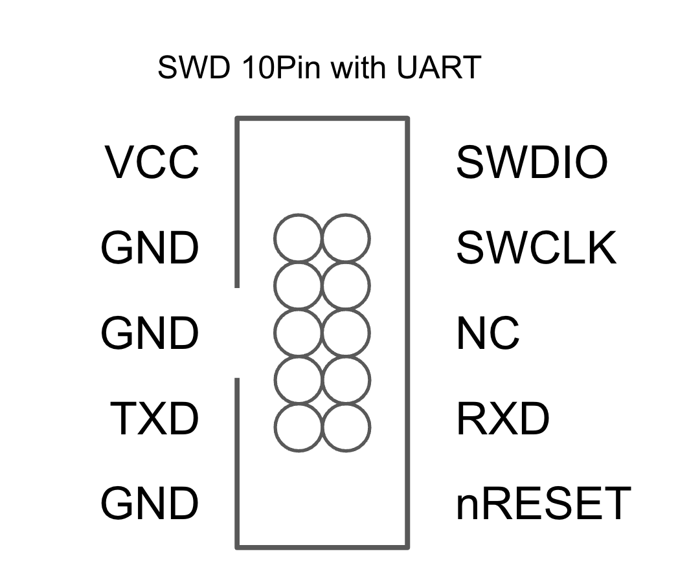
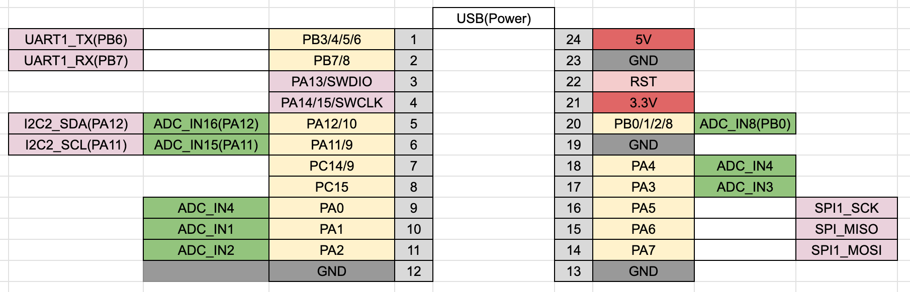
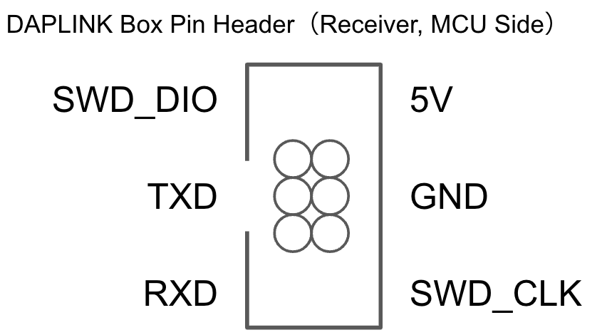

# STM32F03xfxp ProMicro

## v1.3.0

### Documents

- Semantics 回路図 [PDF](stm32g03xfxp-semantcs-v1.3.0.pdf) [kicanvas](https://kicanvas.org/?github=https%3A%2F%2Fgithub.com%2F74th%2Fstm32-promicro%2Fblob%2Fstm32g03xfxp%2Fv1.3.0%2Fstm32g03xfxp%2Fstm32g03xfxp.kicad_sch)
- PCB [kicanvas](https://kicanvas.org/?github=https%3A%2F%2Fgithub.com%2F74th%2Fstm32-promicro%2Fblob%2Fstm32g03xfxp%2Fv1.3.0%2Fstm32g03xfxp%2Fstm32g03xfxp.kicad_pcb)

### Debug Port

The box pin header for DAP Link has the following pin layout.

DAP Link 用のボックスピンヘッダは以下のピン配置になっています。

## Pinout

For other functions, please refer to the datasheet.

他の機能はデータシートを参照ください。

### BOM

| Reference | Name                                  | Quantity |
| --------- | ------------------------------------- | -------- |
| C1        | Capacitor 0805 10uF                   | 1        |
| C2        | Capacitor 0805 2.2uF                  | 1        |
| C3, C4    | Capacitor 0805 100nF                  | 2        |
| D1        | LED 0805 Blue                         | 1        |
| J1        | USB Type-C Receptacle                 | 1        |
| J2        | Box Pin Header 2x5 Pitch 1.27mm (SWD) | 1        |
| R1, R2    | Register 0805 5.1kΩ                   | 2        |
| R3, R4    | Register 0805 10kΩ                    | 2        |
| SW1       | Button SKRPABE010                     | 1        |
| U1        | Regulator 3.3V SOT-89 AMS1117         | 1        |
| U2        | MCU ST STM32G030F6Px                  | 1        |

## v1.2.0

### Documents

- Semantics 回路図 [PDF](stm32g03xfxp-semantcs-v1.2.0.pdf) [kicanvas](https://kicanvas.org/?github=https%3A%2F%2Fgithub.com%2F74th%2Fstm32-promicro%2Fblob%2Fstm32g03xfxp%2Fv1.2.0%2Fstm32g03xfxp%2Fstm32g03xfxp.kicad_sch)
- PCB [PDF](stm32g03xfxp-pcb.pdf) [kicanvas](https://kicanvas.org/?github=https%3A%2F%2Fgithub.com%2F74th%2Fstm32-promicro%2Fblob%2Fstm32g03xfxp%2Fv1.2.0%2Fstm32g03xfxp%2Fstm32g03xfxp.kicad_pcb)

### Debug Port

The box pin header for DAP Link has the following pin layout.

DAP Link 用のボックスピンヘッダは以下のピン配置になっています。

### Pinout

For other functions, please refer to the datasheet.

他の機能はデータシートを参照ください。

### BOM

| id    | parts name                                  | num |
| ----- | ------------------------------------------- | --- |
| J1    | USB 2.0 Type-C Socket (Only Power)          | 1   |
| R1,R2 | 0806 Register 5.1k                          | 2   |
| R4    | 0806 Register 0                             | 1   |
| R3,R6 | 0806 Register 10k                           | 2   |
| C1    | 0806 Capacitor 10u                          | 1   |
| C2    | 0806 Capacitor 2.2u                         | 1   |
| C3,C4 | 0806 Capacitor 100n                         | 2   |
| U2    | TSSOP-20 MCU STM32G030F6Px                  | 1   |
| D1    | 0805 LED Blue                               | 1   |
| U1    | SOT-89 3.3V Regulator AMS1117-3.3           | 1   |
| SW1   | SKRPABE010 Push Switch                      | 1   |
| CH3   | Pitch 1.25mm 2x3 Box Pin Header DAPLink-SWD | 1   |
