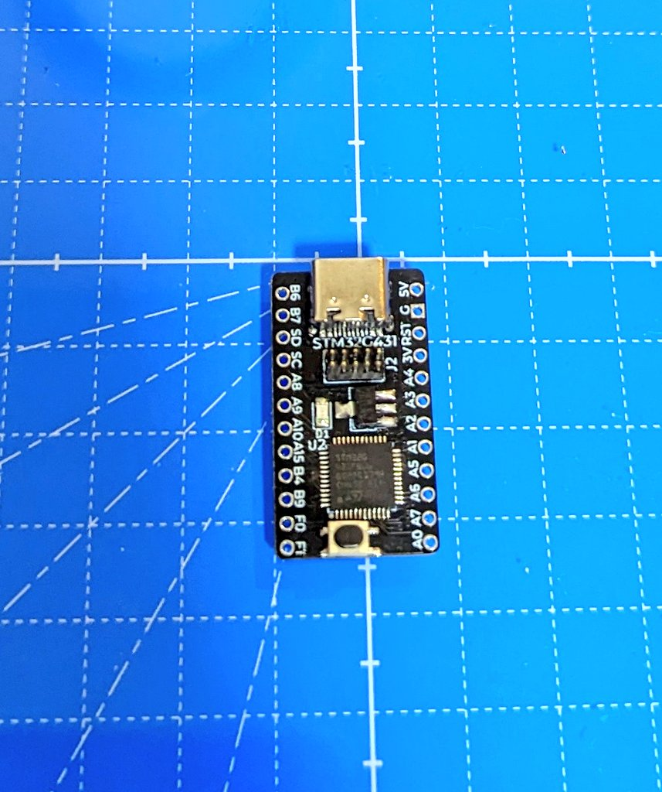
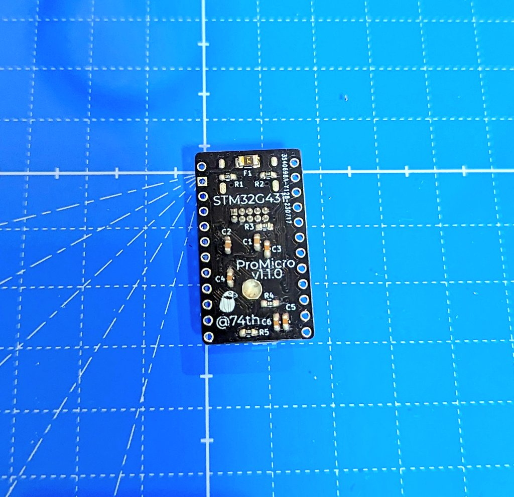
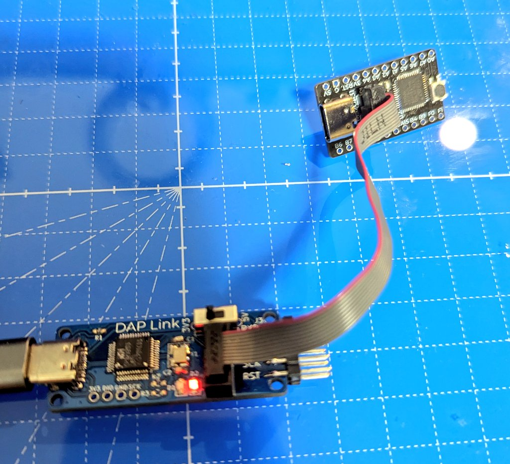

# STM32G431CxUx ProMicro

## v1.1.0

### Documents

- semantics [PDF](./stm32g431-promicro-v1.1.0.pdf) [kicanvas](https://kicanvas.org/?github=https%3A%2F%2Fgithub.com%2F74th%2Fstm32-promicro%2Fblob%2Fstm32g431cxux%2F1.1.0%2Fstm32g431cxux%2Fstm32g431cxux.kicad_sch)
- pcb [kicanvas](https://kicanvas.org/?github=https%3A%2F%2Fgithub.com%2F74th%2Fstm32-promicro%2Fblob%2Fstm32g431cxux%2F1.1.0%2Fstm32g431cxux%2Fstm32g431cxux.kicad_pcd)

### errorta

- Silk on board has F0 and F1 reversed. ボード上のシルクに F0 と F1 が逆になっています。

### BOM

| Reference | Name                              | Quantity |
| --------- | --------------------------------- | -------- |
| C1, C2    | Capacitor 0603 10uF               | 2        |
| C3-C6     | Capacitor 0603 100nF              | 4        |
| D1        | LED 0805 Blue                     | 1        |
| F1        | PolyFuse 1206 Polyfuse            | 1        |
| J1        | USB Type-C Receptacle             | 1        |
| J2        | Box Pin Header 2x5 Pitch 1.27mm   | 1        |
| R1, R2    | Register 0603 5.1kΩ               | 2        |
| R3-R5     | Register 0603 10kΩ                | 3        |
| SW1       | Button SKRPABE010                 | 1        |
| U1        | Regulator 3.3V SOT-89 AMS1117-3.3 | 1        |
| U2        | MCU UFQFPN48 ST STM32G431CBUx     | 1        |
